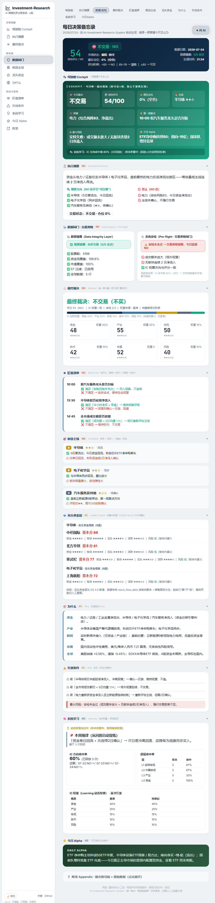

# Xiao Liu Research Lab

## AI-Augmented Investment Research System

An open-source AI-augmented investment research framework — currently a research **system**, evolving toward a personal investment **research operating system**.

> 一个金融人的 AI 时代探索：如何利用人工智能增强投资研究、认知与决策能力。

---

## Vision / 愿景

A personal investment research system that combines **financial expertise, AI capabilities, data analysis, and system thinking** — built to improve *decision quality*, not to predict the market.

> 一个金融人的 AI 时代探索：用人工智能增强投资研究、认知与决策能力，而非替代人的判断。

The long-term trajectory (see [Roadmap](docs/roadmap.md)):

```
AI-Investment-Research-System        (v0.1 · research framework, today)
            ↓
Investment-Research-OS               (v1.0 · integrated research operating system)
            ↓
Xiao Liu Investment Intelligence Platform   (future ecosystem)
```

---

## Why I Built This / 为什么做这个

I have spent years working in finance and investing. The question that has driven me is simple: **in the age of AI, how can an investor think better, research deeper, and decide more discipline — rather than just chase the next "prediction"?**

Most AI-investing projects collapse into one line: `data → model → buy/sell`. They sell a black box that *claims* to know the future. I wanted the opposite — a **research co-pilot** that makes the *process* visible, auditable, and improvable, while the human stays in the loop.

> 作为一名金融从业者和长期投资实践者，我一直在想：AI 时代，投资者如何提升自己的研究和决策能力？
> 这个项目是我的探索：用 AI **增强**人的判断，而不是替代人的判断。

This repository is that exploration — built in public, one trading day at a time.

---

## What is this?

This repository is a **personal investment research system** (the v0.1 framework stage) — a self-contained local stack that turns messy market data into a structured, auditable daily research workflow. The long-term vision is *Investment-Research-OS*; see [Roadmap](docs/roadmap.md).

It is built around a repeatable daily discipline:

> **Market Understanding → Sector Selection → Asset Research → Risk Management → Decision Review**

The system does **not** predict the market, and it is **not** an automated trading system. It is a research co-pilot: it circles the main themes, lists candidates, and attaches the data; the human reads the chart and makes the final call.

```
✅ This IS                                  ❌ This is NOT
─────────────────────────────────────────   ─────────────────────────────────────────
A structured daily research system        A trading bot / auto-trader
An 8-layer decision architecture you can       A black-box "buy/sell" signal generator
  read, audit, and extend                      Financial advice or a money product
A learning system that replays its own past    A hosted SaaS or paid service
  calls to self-correct
A local stack (FastAPI + SQLite + React)       Something that replaces human judgment
```

> **Human-in-the-loop, by design.** The methodology is *板块 > 龙头 > 资金 > 图形* (Sector → Leader → Capital → Chart). The system only "circles the theme → lists candidates → attaches data". The final buy/sell is always a human decision made by reading the chart.

---

## ⚠️ Disclaimer / 免责声明

- This is a **personal research tool**, not a trading product.
- It does **not** place orders, execute trades, or provide personalized financial advice.
- All outputs (daily memos, signals, scores) are **research aids** for the operator's own judgment.
- Markets are risky. Nothing here constitutes investment advice. **Do your own research. Trade at your own risk.**

---

## Philosophy / 研究哲学

Three beliefs separate *research* from *prediction*:

```
Research  >  Prediction      研究 > 预测
Systems   >  Opinions        系统 > 观点
Long-term >  Short-term      长期 > 短期
```

And a three-step daily discipline that is the project's moat:

```
判环境  →  选方向  →  定标的
(Judge the environment)  (Pick the direction)  (Identify the candidate)
```

The investor's edge comes from **better questions and a repeatable process**, not from a black-box that claims to "predict the market". Every trading day the system answers three questions:

> **今天有没有钱？钱去哪？我怎么办？**
> *(Is there money in the market? Where is it going? What should I do?)*

See [`docs/investment-philosophy.md`](docs/investment-philosophy.md) for the full reasoning.

---

## Decision Architecture / 决策架构

A **five-center, eight-layer** decision loop. Market data flows in; research layers reason; an Investment Committee votes; a CIO agent synthesizes the memo; a Learning Center replays past calls to self-correct.

```
        ┌───────────────────────── Data Layer ─────────────────────────┐
        │  TDX local quotes · Eastmoney public APIs · akshare · global  │
        └───────────────────────────────┬──────────────────────────────┘
                                        ▼
   ┌──────────────────── Research Center (8 Layers) ───────────────────┐
   │  Layer 1  Global Macro Environment   全球宏观流动性 / 风险偏好       │
   │  Layer 2  China Macro & Policy       政策 / 流动性 / 情绪 regime     │
   │  Layer 3  Market Cycle               产业趋势 / 周期 / 技术革命       │
   │  Layer 4  Sector Rotation            板块轮动 / 资金迁移链           │
   │  Layer 5  Asset Research (Stock)     个股研究 / 四龙头体系           │
   │  Layer 6  Portfolio Management       买点 / 仓位区间（人工看图）     │
   │  Layer 7  Risk Control               风险预算 → 仓位上限             │
   │  Layer 8  Learning & Reflection      预测回放 / 命中率 / 权重自校准   │
   └───────────────────────────────┬───────────────────────────────────┘
                                    ▼
                 ┌── Investment Committee (single decision source) ──┐
                 │  weighted vote: 资金40 / 产业25 / 宏观15 /          │
                 │  技术10 / 风险10 → can_buy / direction /           │
                 │  position_pct / debate / verdict                   │
                 └───────────────────┬───────────────────────────────┘
                                     ▼
                       ┌── CIO Agent ──┐
                       │ synthesize →  │
                       │ InvestmentDecisionMemo
                       └─────────┬──────┘
                                 ▼
        ┌────────── Learning Center (replay & self-correct) ──────────┐
        │  dimension_accuracy · suggested_weights · regularities       │
        └─────────────────────────────────────────────────────────────┘
```

> **Each layer contributes evidence to the final CIO decision memo** — the architecture is readable and auditable end to end. The implementation also includes a pre-market *narrative layer* (L0) and an *industry-chain drill-down* (L3.5); see [`docs/architecture.md`](docs/architecture.md) for the detailed mapping.

### Decision Engine / 投资委员会

Most AI investment projects collapse to a single line: `data → LLM → buy/sell`. This system inserts a **structured Investment Committee** between the research layers and the final memo — multiple dimensions debate, then vote with fixed weights. The CIO agent only synthesizes *after* the committee reaches a verdict.

| Dimension | Weight | What it answers |
|-----------|:------:|-----------------|
| 💰 Capital Flow (资金) | **40%** | Where is money *actually* moving? |
| 🏭 Industry (产业) | **25%** | Which sectors have real catalysts? |
| 🌐 Macro (宏观) | **15%** | Headwind or tailwind for risk assets? |
| 📈 Technical (技术) | **10%** | Is the entry timing confirmed? |
| 🛡️ Risk (风险) | **10%** | What is the position budget / guardrail? |

```
Capital Flow   40%  ████████████████████████
Industry       25%  ████████████████
Macro          15%  ███████████
Technical      10%  ████████
Risk           10%  ████████
```

The weighted score drives a single decision: **can_buy / direction / position_pct / debate / verdict**.

> **Trust guardrail (by design):** the system *never* executes a trade. The committee and CIO produce research and a recommended stance; the **final buy/sell is always a human reading the chart**. See [`docs/design-principles.md`](docs/design-principles.md).

### Key modules

| Module | Responsibility |
|--------|----------------|
| `backend/daily_collect.py` | Daily data collection: TDX quotes → Eastmoney fallback → global alignment |
| `backend/tech_fill.py` | Technical field backfill (MA20/60, volume ratio, breakout zone) |
| `backend/data_health.py` | 5-point data integrity gate → `trade_allowed` |
| `backend/committee/investment_committee.py` | Weighted IC voting → the single decision source |
| `backend/brain/cio_agent.py` | CIO synthesizes the daily memo (`produce()`) |
| `backend/notify/os2_report.py` | Compressed 9-block daily memo (HTML / WeChat-compatible) |
| `backend/learning_center.py` | Replays predictions, computes hit-rate, self-calibrates weights |
| `backend/panqian_parser.py` | Ingests pre-market briefing notes into the narrative layer |
| `backend/database/models.py` | `init_db()` — all table definitions (empty DB is generated locally) |

> The AI reasoning components call an LLM via a key you supply (front-end or env var). **No key is hardcoded.** The framework degrades gracefully to rule-based scoring when no LLM is configured.

### Daily memo — 9 blocks

`执行摘要 → 最终裁决(加权IC评分) → 盯盘清单 → 候选主线 → 为什么 → 失效条件 → 系统学习 → 今日Alpha → 附录`

A-share convention is respected throughout: **red = up, green = down** (涨红跌绿).

---

## Screenshots / 截图

> Visual proof from a running local instance. This project is currently **A-share (A股) only**; US/HK coverage is on the roadmap.

### Daily CIO Memo · 每日决策备忘录

The compressed, end-to-end decision report — cockpit → verdict → watchlist → candidate sectors → capital-flow layer → why → invalidation → learning loop → cross-asset Alpha.



*Planned next:* Dashboard (market environment + sector heatmap) · Investment Committee (weighted-score voting panel) · Learning Center (prediction replay & self-calibration).

---

## Tech Stack / 技术栈

| Layer | Technology |
|-------|-----------|
| Backend | Python 3.13 · FastAPI · SQLite |
| Frontend | React 19 · Vite · TypeScript · Tailwind CSS · zustand · echarts |
| Data | akshare · Eastmoney public APIs · TDX local quotes (fallback) |
| AI | LLM via env/front-end key (optional, degrades to rule-based) |

---

## Project Structure / 目录结构

```
AI-Investment-Research-System/
├── backend/                    # Python backend (FastAPI + SQLite)
│   ├── app.py                  #   FastAPI entrypoint
│   ├── run_daily.py            #   每日决策流水线入口 (--skip-step1 --memo-only)
│   ├── daily_collect.py        #   数据采集（TDX / 东财兜底 / 全球对齐）
│   ├── tech_fill.py            #   技术字段回填
│   ├── data_health.py          #   数据体检闸门
│   ├── decision_tree.py        #   八层决策树
│   ├── committee/              #   投资委员会（加权投票）
│   ├── brain/                  #   CIO Agent（综合产出 memo）
│   ├── notify/                 #   OS2 压缩日报 / 推送
│   ├── database/               #   models.py (init_db) + 本地 .db（不入库）
│   ├── gold_engine/ capital_flow/  # 黄金 / 资金流引擎
│   ├── learning_center.py      #   学习复盘
│   ├── panqian_parser.py       #   盘前纪要 ingest
│   ├── gstock.py astock.py     #   行情 / 资金流适配器
│   └── config.py               #   渠道开关（默认仅微信公众号 mp）
├── frontend/                   # React 19 + Vite 看板
├── strategy/                   # 方法论文档（市场周期 / 板块 / 龙头 / 风控 / 交易规则）
├── docs/                       # 架构 / 哲学 / 路线图 / 设计原则
└── requirements.txt            # Python 依赖
```

---

## Quick Start / 快速开始

### 1. Backend

```bash
cd backend

# install dependencies
pip install -r requirements.txt

# build an EMPTY local database (the .db file is git-ignored, never committed)
python -c "from database.models import init_db; init_db()"

# collect data for the latest trading day (requires network to data sources)
python daily_collect.py
python tech_fill.py

# run the daily decision pipeline → produces the compressed memo
python run_daily.py --skip-step1 --memo-only

# (optional) start the API + dashboard
python -m uvicorn app:app --host 127.0.0.1 --port 8900
```

### 2. Frontend

```bash
cd frontend
pnpm install       # packageManager is pinned to pnpm
pnpm dev           # Vite dev server
```

Open http://localhost:5899 (or the port printed by Vite).

### 3. Optional — LLM key

The framework runs rule-based out of the box. To enable the AI narrative/reasoning layers, supply an LLM key via the front-end UI or a `.env` file (`backend/.env`, which is **not** committed). See `config.py`.

---

## Data & Privacy / 数据与隐私

- **The database is not included.** `vibe_research.db` is ~5 GB of locally-collected A-share data and is excluded via `*.db` in `.gitignore`. Generate your own with `init_db()` + `daily_collect.py`.
- **No secrets are committed.** `.env`, `.workbuddy/`, `backend/output/`, and personal notes are git-ignored. Eastmoney public tokens are read from environment variables (not hardcoded).
- **No personal holdings or watchlists are uploaded.** This repo ships code and methodology only.

---

## Documentation / 文档

| Doc | What it covers |
|-----|----------------|
| [`docs/research-framework.md`](docs/research-framework.md) | The framework "constitution": philosophy → discipline → 8 layers → committee → learning |
| [`docs/investment-philosophy.md`](docs/investment-philosophy.md) | The moat: 判环境 / 选方向 / 定标的, Research > Prediction |
| [`docs/decision-process.md`](docs/decision-process.md) | The five-step discipline: environment → sector → stock → position → risk |
| [`docs/architecture.md`](docs/architecture.md) | Full 8-layer + L0/L3.5 mapping, IC/CIO, learning loop (current implementation) |
| [`docs/architecture/system-overview.md`](docs/architecture/system-overview.md) | Evolution blueprint: 5-layer architecture & v0.1→v1.0 trajectory |
| [`docs/design-principles.md`](docs/design-principles.md) | Engineering & methodology guardrails |
| [`docs/roadmap.md`](docs/roadmap.md) | What's done and what's next |

---

## Roadmap / 路线图

**Stage-based trajectory:**

| Stage | Theme | Status |
|-------|-------|--------|
| **v0.1** Research Framework | Investment philosophy · decision framework · research workflow | ✅ current (this repo) |
| **v0.2** Research Infrastructure | Data pipeline refinement · database optimization · multi-market expansion | 🔜 next (prototype exists) |
| **v0.3** AI Research Agents | Macro / Sector / Company analyst agents | 🔜 planned |
| **v1.0** Investment Research OS | Integrated AI-enhanced research operating system | 🎯 long-term |

Detailed plan in [`docs/roadmap.md`](docs/roadmap.md).

**Within v0.1:**

- [x] Eight-layer decision architecture + Investment Committee voting
- [x] CIO memo synthesis + compressed 9-block daily report
- [x] Learning loop (prediction replay + weight self-calibration)
- [x] Data integrity gate (5-point health check)
- [ ] Broader industry-chain drill-down (L3.5)
- [ ] Risk-budget → position sizing refinement (L7)
- [ ] Public strategy docs expansion under `strategy/`

Contributions and discussion are welcome — see `CONTRIBUTING.md`.

---

## License / 协议

[MIT](LICENSE) — free to use, modify, and learn from. Not liable for any trading decisions.

---

## About / 关于

**Xiao Liu Research Lab** — a finance professional exploring how AI can augment — not replace — an investor's research, cognition, and decision-making.

- Research > Prediction
- Systems > Opinions
- Long-term Thinking > Short-term Trading

> This GitHub repo is my "technical paper". The accompanying YouTube channel is the "open classroom". The investment system is the "core product" — together they form a closed loop of learning in public.
